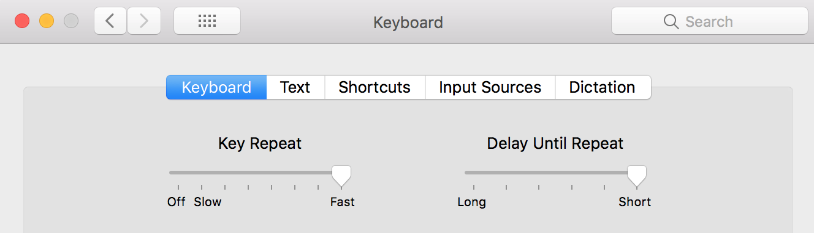
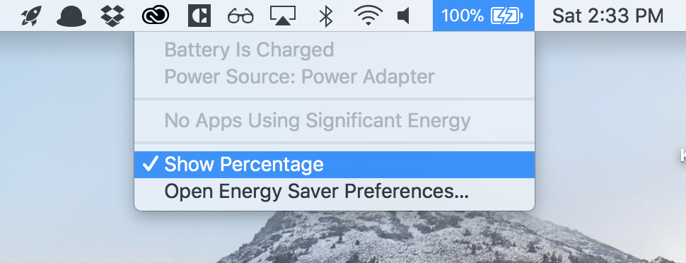
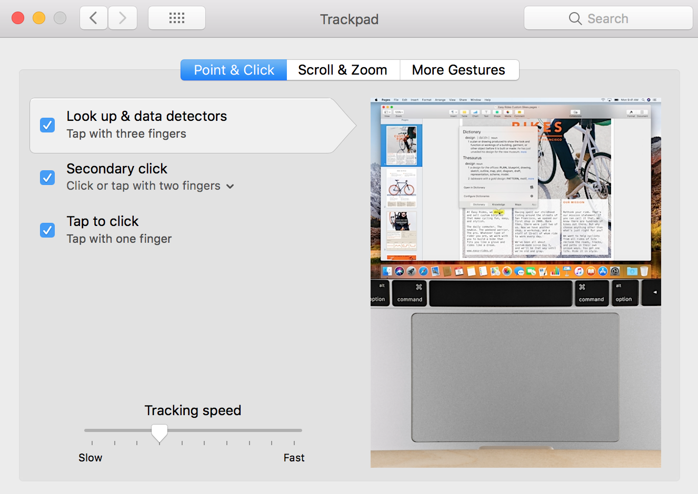
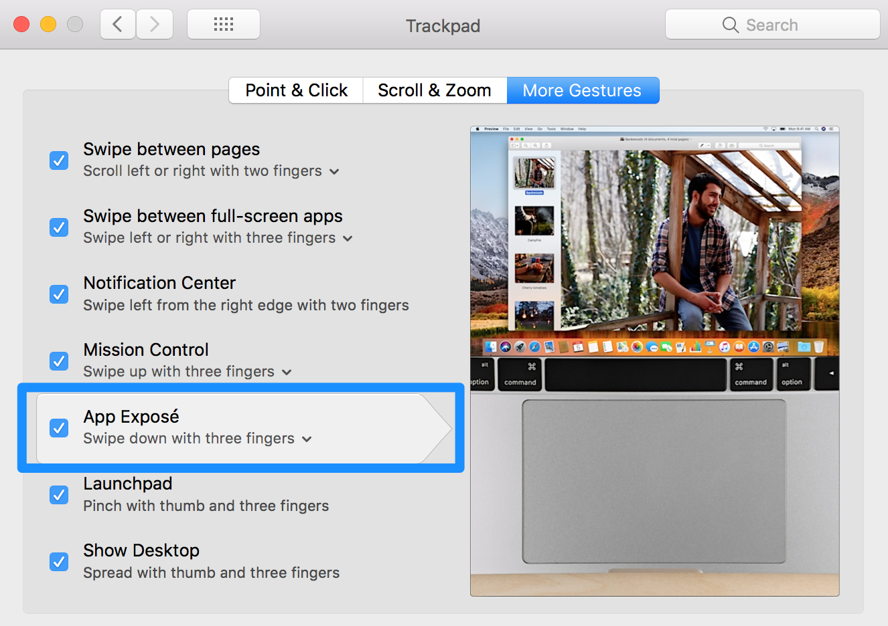
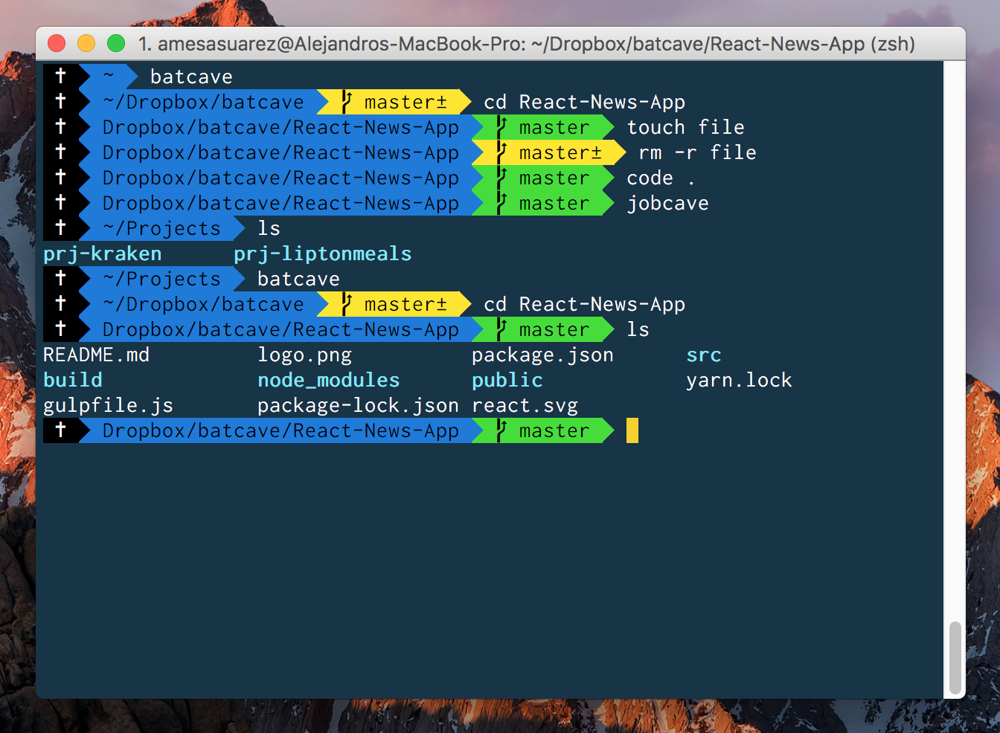
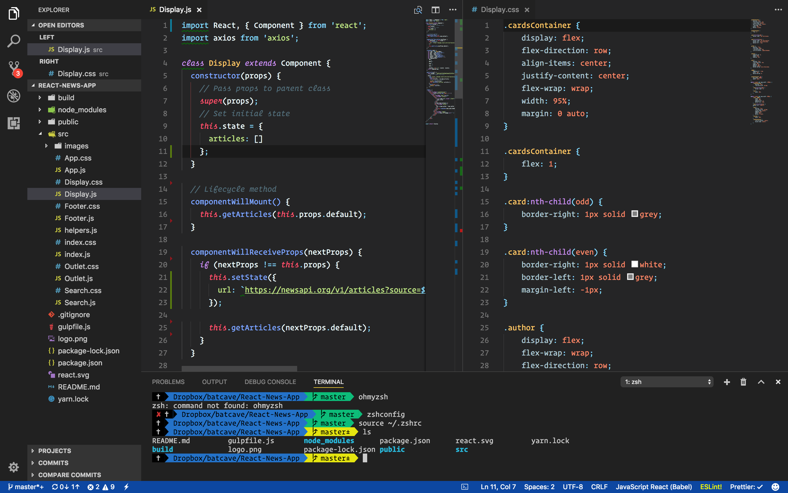
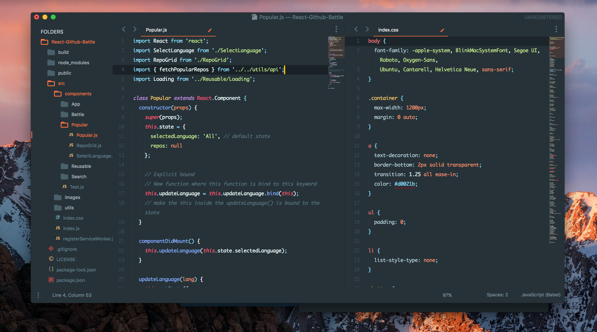
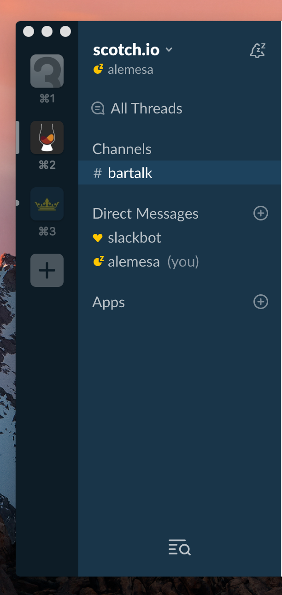
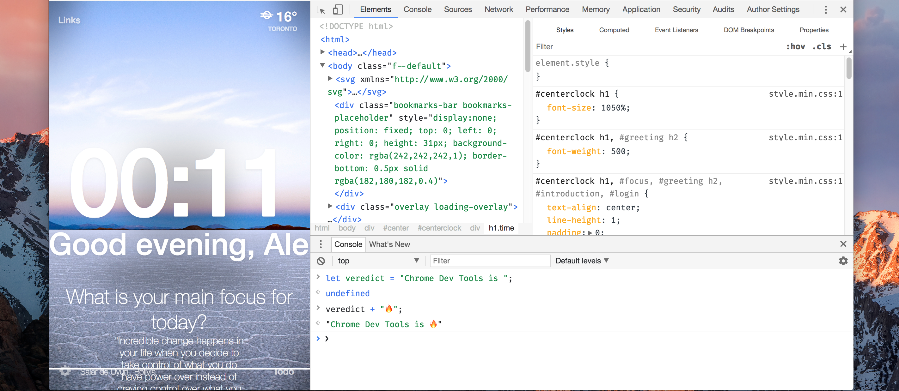

# Mac-Setup


! Work in progress
- [Start](#start)
- [Fonts](#fonts)
- [iTerm2](#iterm2)
- [Homebrew](#homebrew)
- [Bash](#bash)
- [Git](#git)
- [VSCode](#vscode)
- [Sublime Text](#sublime)
- [MySQL](#mysql)
- [Node](#node)
- [Slack](#slack)
- [Alfred](#alfred)
- [DevToolsAuthor](#devtoolsauthor)
- [Others](#others)
- [Python](#python)
- [Heroku](#heroku)
- [Thanks!](#thanks)

### Start
---
<h4 style="width:60%; margin:0 auto ;text-align:center; background-color:#F2453E; color:white">Start Here Please</h4>   

Quality of Life changes:
- Instal XCode Suite (even if you don't need it anymore you will probably need along the road)
```bash
xcode-select --install
```
- Install [Google Chrome](www.google.com/chrome) (Make it default)
- Remove useless icons from the sidebar
- Speed up the keyboard on Preferences (🔥 Hot Tip)
- Show battery percentage, right click battery
- Change the TrackPad to tap to click
- Activate App Expose on the TrackPad Gestures

<div align="center">




</div>


### Fonts
---
`Better Fonts for Development`

I like these fonts:
 - FiraCode (free) - [link](https://github.com/tonsky/FiraCode)
 - Operator Mono ($200) - [link](https://www.typography.com/blog/introducing-operator)
 - Hack (free) - [link](https://github.com/source-foundry/Hack)

Visit [Nerd Fonts](https://nerdfonts.com/) They have a long list of good programming fonts (Hot Tip: 🔥)

Operator Mono has cursive ligatures and Fira Code contains operator ligatures, to install just double clicked them.


### iTerm2
___

`Epic Better Console`

* Download and install [iTerm2](http://www.iterm2.com/)

* In **iTerm > Preferences...**, under the tab **General**, uncheck **Confirm closing multiple sessions** and **Confirm "Quit iTerm2 (Cmd+Q)" command** under the section **Closing**.

* In the tab **Profiles**, create a new one with the "+" icon, and rename it to your first name for example. Then, select **Other Actions... > Set as Default**. Finally, under the section **Window**, change the size to something better, like **Columns: 125** and **Rows: 35**.

* Configure oh-my-zsh with Cobalt2

Paste on a terminal to install Oh-My-Zsh
```bash
sh -c "$(curl -fsSL https://raw.githubusercontent.com/robbyrussell/oh-my-zsh/master/tools/install.sh)"
```

Install Powerline-Fonts
```bash
# clone
git clone https://github.com/powerline/fonts.git --depth=1
# install
cd fonts
./install.sh
# clean-up a bit
cd ..
rm -rf fonts
```

1. Drop the cobalt2.zsh-theme file in to the ~/.oh-my-zsh/themes/ directory.
2. Open up your ZSH preferences at ~/.zshrc and change the theme variable to ZSH_THEME=cobalt2.
3. In iTerm2 access the Preferences pane on the Profiles tab.
4. Under the Colors tab import the cobalt2.itermcolors file via the Load Presets drop-down.
5. Under the Text tab change the font for each type (Regular and Non-ASCII) to 'Inconsolata for Powerline'. (Refer to the powerline-fonts repo for help on font installation.)
6. Refresh ZSH by typing source ~/.zshrc on the command line.

Download Cobalt2-iterm from [here](https://github.com/wesbos/Cobalt2-iterm)


`Screenshot of iTerm2 with ZSH + Inconsolata for Powerline`

<div align="center">
    
</div>

* Modify starting folder on **iTerm/Preferences**

### Homebrew
___
`Package Manager for OSX`

Find the documentation and manual install here
 [Homebrew](http://brew.sh/).


* Install Homebrew on the terminal
```bash
/usr/bin/ruby -e "$(curl -fsSL https://raw.githubusercontent.com/Homebrew/install/master/install)"
```

* One thing we need to do is tell the system to use programs installed by Hombrew (in `/usr/local/bin`) rather than the OS default if it exists. We do this by adding `/usr/local/bin` to your `$PATH` environment variable:

```bash
echo 'export PATH="/usr/local/bin:$PATH"' >> ~/.bash_profile
```


* Install MacOS CLI and sign in to be able to install from the store directly from the console

```bash
brew install mas
mas signin mail@mail.com
```
* Create a file called brewfile

```bash
touch ~/brewfile
```
* My Brewfile

```bash
## Required to install almost every app
tap 'caskroom/cask'

# Essentials
brew 'git'          # Essential
brew 'node'         # Essential comes with npm
brew 'heroku'       # Cloud Based Paas
brew 'git-lfs'      # Git Big Files Transfer
brew 'yarn'         # npm on 💊
brew 'zsh-completions'
brew 'tree'         # Tree Command

# Browsers
cask 'google-chrome' # Browser
cask 'firefox'       # Browser

# Coding Essentials
cask 'visual-studio-code'   # Awesomeness 🎆 💻 🎆
cask 'github-desktop'       # Git GUI
cask 'sublime-text'         # Ultra fast 🏃

# Design Essentials
cask 'sketch'        # Epic design tool
cask 'noun-project'  # Free icons

# MAC Quality of life
cask 'rocket'        # Emojis on 💊
cask 'alfred'        # Spotlight on 💊
cask 'spectacle'     # Windows Rearrangment

# Utilities
cask 'spotify'       # Music
cask 'slack'         # Chat - Work
cask 'discord'       # Chat - Games
cask 'whatsapp'      # Chat - Personal
cask 'flux'          # Eyes Health
cask 'adobe-acrobat-reader'    # PDF Reader
cask 'transmission'  # Torrents Manager   
cask 'postman'       # Api Requests
cask 'calibre'       # E-Books Manager

# Cloud
cask 'dropbox'                 # Dropbox Cloud  
cask 'google-backup-and-sync'  # Google Cloud

# Coding Utilities
cask 'sequel-pro'    # SQL
cask 'vlc'           # Videos
cask 'filezilla'     # FTP

# Others
mas 'Amphetamine' id: 937984704 # Stop Mac from sleeping
mas 'Parcel - Delivery Tracking' id: 639968404 # Delivery Tracking
mas 'Pocket', id: 568494494 # Saved articles
mas 'Skitch - Snap. Mark up. Share.', id: 425955336 # Markup tools
mas 'Dr. Cleaner: Disk,Memory,System Optimizer', id: 921458519 # Clean memory and space 
mas 'GIPHY Capture. The GIF Maker', id: 668208984 # Capture Gifs + Captions
mas 'Trello', id: 1278508951 # Task Manager
```
Feel free to add or remove apps

Find the apps either on the [Cask Search Website](https://caskroom.github.io/search)
or use this on the console
```bash
brew cask search <package>
```
or use this to find apps with Mas on the console
```bash
mas search slack
```
* Install everything by running this

```bash
brew bundle install
```

* Install these apps manually
  - Microsoft Office Suite

### Bash
___

* Create a .bash_profile

```bash
touch ~/.bash_profile
```

* Brewup

Add useful alias

```bash
alias brewup='brew update; brew upgrade; brew prune; brew cleanup; brew doctor'
```
Restart bash profile and run __brewup__

```bash
source ~/.bash_profile
brewup
```

Now you can run  and that's it it will update homebrew packages

### Git
___
`Configure Git and Aliases`
```bash
touch ~/.gitconfig
git config --global user.name "First Last"
git config --global user.email "Email"
git config --global credential.helper osxkeychain
```

Typical .gitconfig will look like this, be free to remove aliases 

```bash
[user]
    name = First Last
    email = email@email.com
[github]
    user = username
[alias]
    a = add
    ca = commit -a
    cam = commit -am
    s = status
    pom = push origin master
    pog = push origin gh-pages
    puom = pull origin master
    puog = pull origin gh-pages
    cob = checkout -b
[credential]
    helper = osxkeychain
```

`Generate a new SSH Key`
```
ssh-keygen -t rsa -C "your_email@example.com"
```
Add the key to your Github Account

Add the DS_Store to your gitignore

```bash
# specify a global exclusion list
git config --global core.excludesfile ~/.gitignore
# adding .DS_Store to that list
echo .DS_Store >> ~/.gitignore
```
Or add this [gitignore](https://github.com/github/gitignore/blob/master/Global/macOS.gitignore) file mantained by Github to your gitignore


I like to keep my alias on .zshrc

Open ~/.zshrc and at the end add these alias

```bash
alias zshconfig="code ~/.zshrc" # Modify this file
alias cd..="cd .." # Most Important Alias
alias batcave="cd ~/Dropbox/batcave" # Side Projects
alias jobcave="cd ~/Projects" # 8hrs Job Project
alias brewup='brew update; brew upgrade; brew prune; brew cleanup; brew doctor' # Quick House Cleaning
```

### VSCode
___
`Best Code Editor`

* Use Settings-Sync Extension

Find my config [here](https://gist.github.com/alemesa/e1d85a6d82e56872f6ddfaf73fc11537)

Open VSCode and type "shell command" and add to the PATH. Close VSCODE, restart Terminal , now you can use any project with this

```bash
code \directory\to\open
```

My User Settings look like this [October 2017]
```javascript
{
  // Settings for Material Theme
  // Place your settings in this file to overwrite the default settings
  "editor.fontFamily":
    "'Operator Mono','Fira Code',Consolas, Monaco, 'Courier New', monospace",
  "editor.fontSize": 15,
  "editor.lineHeight": 25,
  "editor.lineNumbers": "on",
  "workbench.sideBar.location": "left",
  //GIST SYNCYING
  "sync.gist": "e1d85a6d82e56872f6ddfaf73fc11537",
  "sync.lastUpload": "2017-10-05T17:57:45.551Z",
  "sync.autoDownload": true,
  "sync.autoUpload": true,
  "sync.lastDownload": "2017-09-26T13:53:50.621Z",
  "sync.forceDownload": false,
  "sync.anonymousGist": false,
  "sync.host": "",
  "sync.pathPrefix": "",
  // THEME AND ICON
  "workbench.colorTheme": "Sublime Material Theme - Dark",
  "workbench.iconTheme": "seti",
  // WORKBENCH CUSTOMIZATION
  "workbench.colorCustomizations": {
    "statusBar.background": "#0D47A1",
    "activityBar.background": "#212121",
    "activityBarBadge.background": "#f44336",
    "sideBar.background": "#212121",
    "tab.activeBackground": "#212121",
    "tab.border": "#212121",
    "editorLineNumber.foreground": "#757575",
    "panel.background": "#212121",
    "panelTitle.activeBorder": "#FDD835"
  },
  // OTHERS
  "emmet.syntaxProfiles": {
    "javascript": "jsx"
  },
  "editor.renderIndentGuides": false,
  "git.enableSmartCommit": true,
  "editor.formatOnSave": true,
  "eslint.autoFixOnSave": true,
  "prettier.singleQuote": true,
  "terminal.integrated.shell.osx": "/bin/zsh",
  "sync.quietSync": false,
  "sync.askGistName": false,
  "terminal.integrated.fontSize": 14,
  "editor.tabCompletion": true,
  "javascript.format.enable": false,
  "prettier.eslintIntegration": true,
  "editor.cursorBlinking": "blink",
  "window.zoomLevel": 0
  //"stylelint.enable": true,
  //"css.validate": false,
  //"scss.validate": false
  // Settings for WesBos theme
}
```

`Screenshot of Visual Studio Code + Operator Mono`

<div align="center">
    
</div>


### Sublime
`Second Best Code editor`

* Install Package Manager

Go [here](https://packagecontrol.io/installation)

* Follow this [guide](https://engageinteractive.co.uk/blog/getting-setup-on-sublime-text-3-2017-edition) to install theme and plugins

* Install Babel for React syntax
    - Follow this [guide](https://github.com/babel/babel-sublime)

* Be able to open sublime from the command line

    - Paste this on the command line
```bash
ln -s "/Applications/Sublime Text.app/Contents/SharedSupport/bin/subl" /usr/local/bin/sublime
```

* Fonts:
    - Operator Mono

`Screenshot of Sublime Text 3 + Operator Mono`

<div align="center">
    
</div>

### MySQL
___

* To install, run:

```bash
brew update # Always good to do
brew install mysql
``` 

* Setup MySQL

```bash
unset TMPDIR
mkdir /usr/local/var
mysql_install_db --verbose --user=`whoami` --basedir="$(brew --prefix mysql)" --datadir=/usr/local/var/mysql --tmpdir=/tmp
```

* Usage
To start the MySQL server, use the `mysql.server` tool:
```bash
mysql.server start # start server
mysql.server stop  # stop server
mysql.server --help # find other commands
mysql -uroot # connect with the command-line client
exit # to quit the shell
```

### Node
___

* Install Node

```bash
curl -o- https://raw.githubusercontent.com/creationix/nvm/v0.33.1/install.sh | bash
nvm install node
nvm use node
node -v
```

* Add to path

To do so, add this line to your `~/.path` file, before the `export PATH` line:

```bash
PATH=/usr/local/share/npm/bin:$PATH
```

`npm Usage`

npm Commands:
```bash
npm install <package>    # Install locally
npm install -g <package> # Install globally
npm install <package> --save # Save to a package.json file
npm list                # What's installed Locally
npm list -g             # what's installed Globally
npm outdated [-g]       # Find outdated packages    
npm update [<package>]  # Upgrade particular package
npm uninstall <package> # Uninstall Packages
```

`npm Goodies`
* **Gulp**
```js
npm install --global gulp-cli
```

* **Surge**
 Surge Deploy
```bash
npm install -g surge
```
* To deploy a project
```bash
surge <path>
```

### Slack

[Repo here](https://github.com/wesbos/Cobalt2-Slack)

* `Preferences` → `Sidebar Theme`
* Paste `#193549,#FFC600,#1D425D,#FFFFFF,#FFC600,#FFFFFF,#FFC600,#FFC600`

<div align="center">
    
</div>

### Alfred

* Make Alfred substitute for Spotlight
* Install this [theme](https://github.com/wesbos/Cobalt2-Alfred-Theme) if you have the Powerpack ($50)


### DevToolsAuthor

Follow this [guide](http://mikeking.io/devtools-author/) and then select a theme on the Author Settings tab inside the Chrome Dev Tools. I'm using the `Google Theme` with `Fira Code` font and `13px` size.

<div align="center">
    
</div>


### Others

* Show hidden files, paste this on the command line
```bash
defaults write com.apple.finder AppleShowAllFiles YES
```

* Show path bar
```bash
defaults write com.apple.finder ShowPathbar -bool true
```

* Show status bar
```bash
defaults write com.apple.finder ShowStatusBar -bool true
```

### Python
---

`Raspberry Fun`

```bash
brew install python
```

It also installed pip (and its dependency Setuptools), which is the package manager for Python. Let's upgrade them both:

```bash
$ pip install --upgrade setuptools
$ pip install --upgrade pip
```
### Heroku
---

`Heroku is a Platform-as-a-Service (PaaS) that simplifies deploying your apps online.`

**Installation**

Assuming that you have an Heroku account (sign up if you don't), let's install the Heroku Client for the command-line using Homebrew.

$ brew install heroku-toolbelt
The formula might not have the latest version of the Heroku Client, which is updated pretty often. Let's update it now:

$ heroku update
Don't be afraid to run heroku update every now and then to always have the most recent version.

**Setup**

Login to your Heroku account using your email and password:

```bash
heroku login
```

If this is a new account, and since you don't already have a public SSH key in your ~/.ssh directory, it will offer to create one for you. It will also upload the key to your Heroku account, which will allow you to deploy apps from this computer.

If it didn't offer create the SSH key for you (i.e. your Heroku account already has SSH keys associated with it), you can do so manually by running:

```bash
mkdir ~/.ssh
ssh-keygen -t rsa
```
Keep the default file name and skip the passphrase by just hitting Enter both times. Then, add the key to your Heroku account:

```bash
heroku keys:add
```
Usage

Once your keys are in place and you are authorized, you're ready to deploy apps. Heroku has a getting started [guide](https://devcenter.heroku.com/articles/python). Heroku uses Git to push code for deployment, so make sure your app is under Git version control.

**A cheat sheet for deployment**:

```bash
cd myapp/
heroku create myapp
git push heroku master
heroku ps
heroku logs -t
```
The Heroku Dev Center is where you will find more information.

### Thanks
---

* Inspired by [Nicolashery Similar Repo](https://github.com/nicolashery/mac-dev-setup)
* Also partially inspired by this [post](https://www.taniarascia.com/setting-up-a-brand-new-mac-for-development/) from Tania Rascia
* Also by this [book](http://sourabhbajaj.com/mac-setup)
* Big thanks to [WesBos 🍖](http://wesbos.com/) because yeah I use everything he uses, he's pure 🔥🔥🔥 


